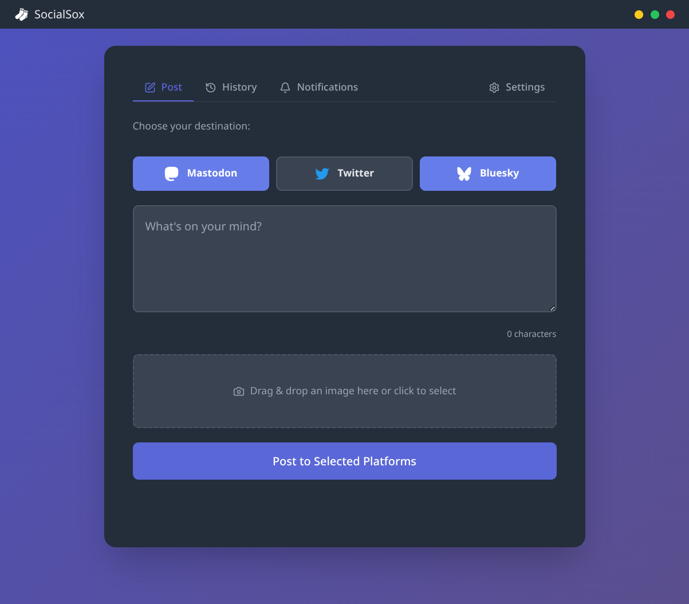
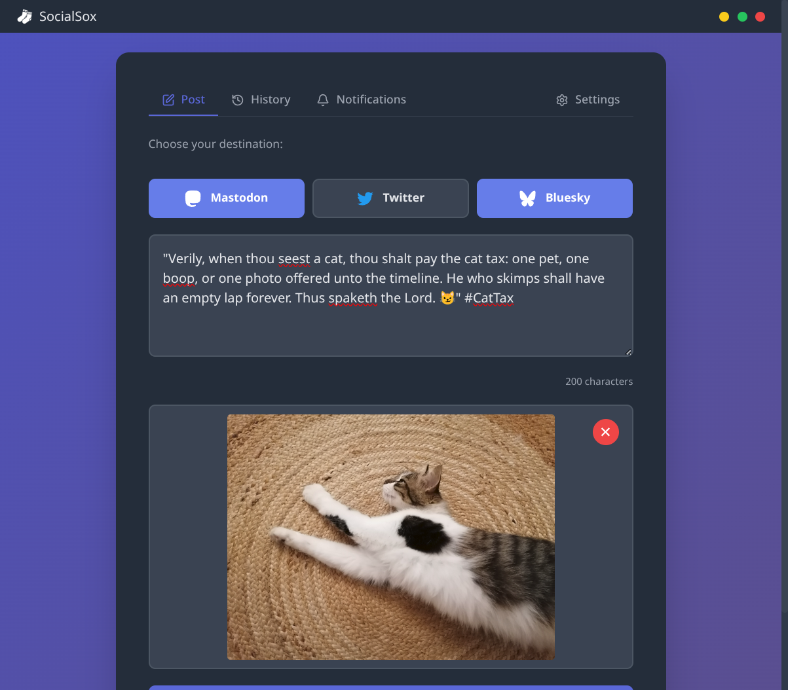
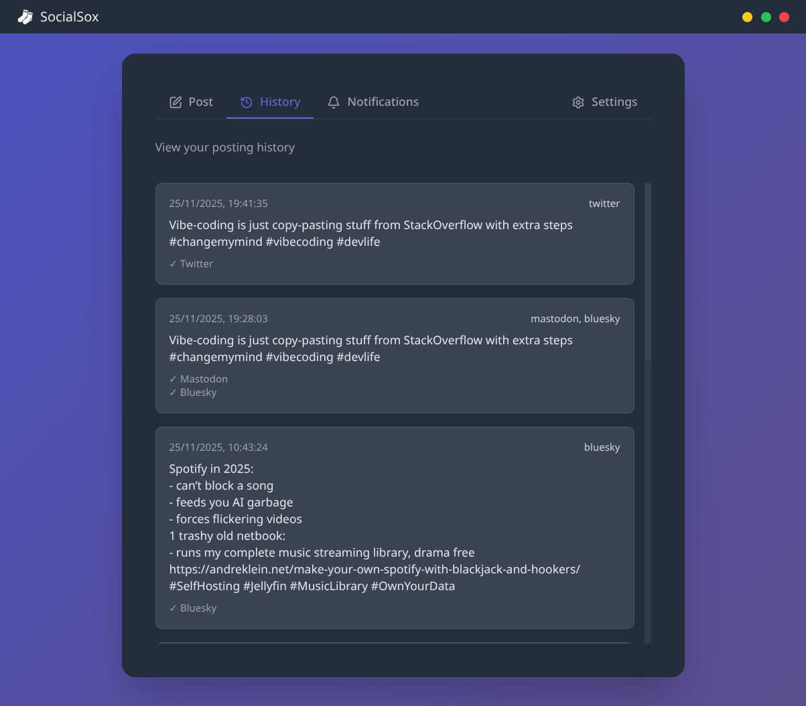
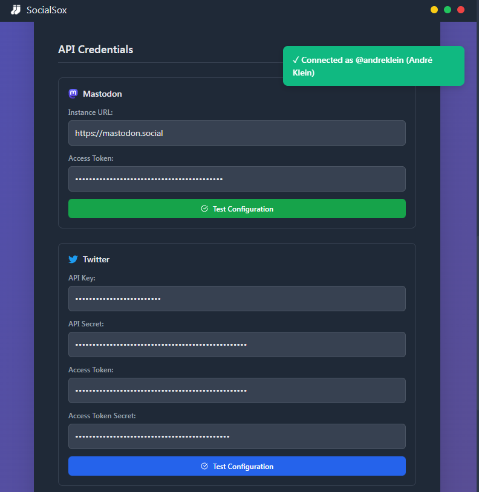
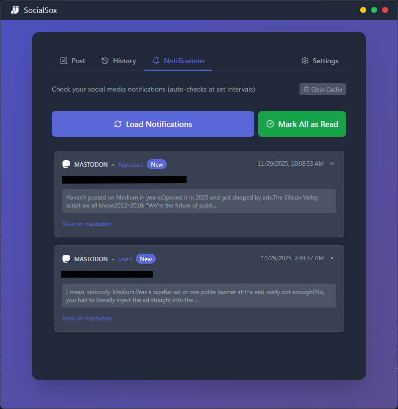

#  SocialSox

A simple, open source cross-platform desktop app for posting short messages to Mastodon, X (aka Twitter), and Bluesky separately or simultaneously.

## Why SocialSox?

Today's social media landscape is fragmented. Your audience is scattered across Mastodon, Bluesky, and X, but existing tools are either browser-based tab juggling, overpriced SaaS, or complex self-hosted setups. SocialSox gives you a simple, free desktop app that does one thing well: post your message everywhere at once.

## Features

**Core Posting**
- 📝 Post to one or all platforms simultaneously
- 🖼️ Multiple image uploads (up to 4) with drag-and-drop
- 🔄 Drag to reorder images before posting
- 📊 Real-time character counter per platform

**Management & History**
- 📜 View posting history with status tracking
- 🔔 Monitor replies, likes, and reposts
- ✅ Per-platform delivery status

**Privacy & Security**
- 🔒 Credentials encrypted using OS-level security
- 🖥️ Runs entirely on your machine—no cloud required
- 📥 Export/import credentials for backup

**Customization**
- 🎨 Native dark mode support
- ⚙️ Customizable tray icons and window decorations

## Screenshots

### Message Composition


### Posting with Images


### Posting History


### Settings & Credentials


### Notifications


## Project Notes

> [!NOTE]
> **This is a small focused vanilla JavaScript project with Tailwind and Lucide Icons** built for a simple need. [Read the blog post about how and why I built it](https://andreklein.net/i-built-my-own-damn-crossposter-because-2025-social-media-is-a-fragmented-hellscape/). It may benefit from refactoring to React/TypeScript in the future.

> [!TIP]
> **Minimalist by design** - I have no plans to turn this into a super-app with endless features. For more advanced social media management tools, check out [Postiz](https://github.com/gitroomhq/postiz-app).

> [!IMPORTANT]
> **Current implementation details:**
> - Tailwind CSS and Lucide icons are bundled with the app
> - Only essential Lucide icons are imported to minimize bundle size
> - Tested on Linux (Arch CachyOS) and Windows 11
> - Mac builds need testing

## Project Structure

The application follows a modular architecture to keep code organized and maintainable. The core functionality is split into separate modules located in the `src/modules/` directory:

```
src/
├── modules/
│   ├── history.js          # Handles posting history and status tracking
│   ├── imageUpload.js      # Manages image upload functionality
│   ├── notifications.js    # Handles platform notifications
│   ├── platforms.js        # Contains platform-specific API integrations
│   ├── storage.js          # Manages secure credential storage
│   └── ui.js               # UI-related utilities and helpers
```

This modular approach allows for easy maintenance and future extensions.

## Quick Start

### Option 1: Download Pre-built App (Recommended)

Download the latest [release](https://github.com/burninc0de/socialsox/releases/) for your platform:
- **Windows**: `.exe` installer
- **macOS**: `.dmg` file
- **Linux**: `.AppImage` file

### Option 2: Run from Source (Developers)

```bash
npm install
npm run dev
```

This starts the Vite dev server with hot-reload and automatically launches the Electron app for development.

### Option 3: Build Distributable Packages

```bash
npm run build
```

This creates platform-specific packages in the `dist/` folder:
- **Linux**: `.AppImage` file
- **macOS**: `.dmg` file  
- **Windows**: `.exe` installer

## Setup

Use the **Settings** tab to configure your API credentials. They're encrypted locally using Electron's safeStorage for security.

### Get Your API Credentials

#### Mastodon

1. Log in to your Mastodon instance (e.g., mastodon.social)
2. Go to Settings → Development → New Application
3. Give it a name (e.g., "SocialSox")
4. Select permissions: `read:notifications`, `write:media`, `write:statuses`
5. Click "Submit"
6. Copy your **instance URL** (just the domain like `https://mastodon.social`, NOT your profile URL)
7. Copy your **access token** from the application page

#### Bluesky

1. Log in to Bluesky
2. Go to Settings → App Passwords
3. Create a new app password
4. Use your handle (e.g., `username.bsky.social`) and the app password

#### X (aka Twitter)

1. Go to [X Developer Portal](https://developer.X.com/en/portal/dashboard)
2. Create a project and app (or use existing)
3. **Configure OAuth 1.0a permissions:**
   - Click on your app → **Settings** tab → "User authentication settings"
   - Click **"Set up"** or **"Edit"**
   - Enable **OAuth 1.0a** (choose "Web App, Automated App or Bot")
   - Set **App permissions** to **"Read and Write"**
   - Add any valid URL for Callback/Website (your GitHub repo works fine—these won't be used but X requires them)
   - Click **Save**
4. Go to **"Keys and Tokens"** tab
5. **Regenerate** your Access Token and Access Token Secret (important after changing permissions!)
6. Copy all 4 credentials:
   - **API Key** (also called Consumer Key)
   - **API Secret** (also called Consumer Secret)
   - **Access Token** (newly regenerated)
   - **Access Token Secret** (newly regenerated)

### Test Credentials & Post

Use the "Test Configuration" buttons in Settings to conveniently verify your credentials are working correctly.

**Portability**: Use the "📤 Export Credentials" button to save your credentials to a JSON file for backup or transfer to another device. Use "📥 Import Credentials" to load them back.

Switch to the **Post** tab to:
- Select platforms to post to
- Type your message (with character counter)
- Upload images (drag & drop or click, max 4)
- Reorder images by dragging them
- Click "Post to Selected Platforms"!

Check the **History** tab to view your past posts and their status.

## Security Notes

> [!NOTE]
> **Security Features:**
> - ✅ Everything runs locally on your computer
> - ✅ Credentials are encrypted using Electron's safeStorage (OS-level encryption)
> - ✅ X OAuth handled securely in Electron backend
> - ✅ No external servers involved (except the social media APIs)
> - ✅ Notifications cache stored in notifications.json

> [!WARNING]
> **Security Considerations:**
> - ⚠️ SafeStorage encryption requires your OS to have a password/login set up
> - ⚠️ If safeStorage is unavailable, credentials fall back to encrypted localStorage
> - ⚠️ Use app-specific passwords where available (like Bluesky's app passwords)

For security-related concerns, please see our [Security Policy](SECURITY.md).

## Limitations

> [!CAUTION]
> **Current Limitations:**
> - Maximum 4 images per post (platform API limits)
> - No thread/reply support
> - Character limits: X 280 chars, Mastodon 500+ (varies by instance), Bluesky 300 chars
> - Image size limit: 5MB per image
> - Image format support: PNG, JPG, GIF, WebP

## Troubleshooting

**App won't start or icons don't load**: Try running with debug console: `DEBUG=1 ./SocialSox.exe` (Windows) or `DEBUG=1 ./SocialSox` (Linux/Mac) to see error messages.

**Having issues with notifications, settings, or credentials?** Use the red "CLEAR ALL DATA" button in Settings for a complete reset - it wipes everything for a fresh start!

> [!IMPORTANT]
> **X Errors**:
> - **"oauth1 app permissions" error**: Your app isn't configured correctly
>   1. Go to your app's **Settings** → "User authentication settings"
>   2. Enable **OAuth 1.0a** with **"Read and Write"** permissions
>   3. Go to **"Keys and Tokens"** tab
>   4. **Regenerate** your Access Token and Access Token Secret (critical!)
>   5. Use the new tokens in SocialSox
> - Make sure you have all 4 credentials entered correctly
> - Old tokens won't work after changing permissions - you must regenerate them

> [!TIP]
> **Common Configuration Issues**:
> - **Instance URL Errors**: Use only the domain (e.g., `https://mastodon.social`), not your profile URL
> - **Mastodon Errors**: Make sure your instance URL is correct and includes `https://`
> - **Bluesky Errors**: Use your full handle including the domain (e.g., `user.bsky.social`)
> - **Image Upload Issues**: Ensure each image is under 5MB and in a supported format (PNG, JPG, GIF, WebP)
> - **Image Order**: Drag and drop images to reorder them - the order in the preview is the order they'll appear in your post

## Data Storage & Clearing Saved Data

SocialSox stores your data locally on your computer. Here's where to find and manage it:

### Windows
**Location**: `%APPDATA%\socialsox\`  
**Full path**: `C:\Users\[YourUsername]\AppData\Roaming\socialsox\`

### macOS
**Location**: `~/Library/Application Support/socialsox/`

### Linux
**Location**: `~/.config/socialsox/`

### Files Stored
- `notifications.json` - Cached notifications from platforms
- `history.json` - Your posting history and status tracking
- `window-config.json` - Window position and size preferences

### Clearing Data Manually
If you need to clear data manually (or the in-app "Clear All Data" button doesn't work):
1. Close SocialSox completely
2. Navigate to the folder above for your platform
3. Delete the files you want to clear:
   - Delete `notifications.json` to clear notification cache
   - Delete `history.json` to clear posting history
   - Delete `window-config.json` to reset window preferences
4. Restart SocialSox

> [!NOTE]
> Your encrypted API credentials are stored separately using your operating system's secure storage and won't be in these folders.

## Development

### Prerequisites

- Node.js 18+
- npm or yarn

### Setup

```bash
git clone https://github.com/burninc0de/socialsox.git
cd socialsox
npm install
```

### Development Commands

```bash
# Development mode (Vite dev server + Electron with hot-reload)
npm run dev

# Build production distributables
npm run build

# Run the pre-built production app (after building)
npm start
```

### Debugging Built App

To run the built app with developer console:

- Windows: `DEBUG=1 && dist\win-unpacked\SocialSox.exe`
- Linux: `DEBUG=1 ./dist/linux-unpacked/SocialSox`
- macOS: `DEBUG=1 ./dist/mac/SocialSox.app/Contents/MacOS/SocialSox`

## License

This project is licensed under the MIT License - see the [LICENSE](LICENSE) file for details.

## Contributing

Please read [CONTRIBUTING.md](CONTRIBUTING.md) for details on the process for submitting pull requests.
